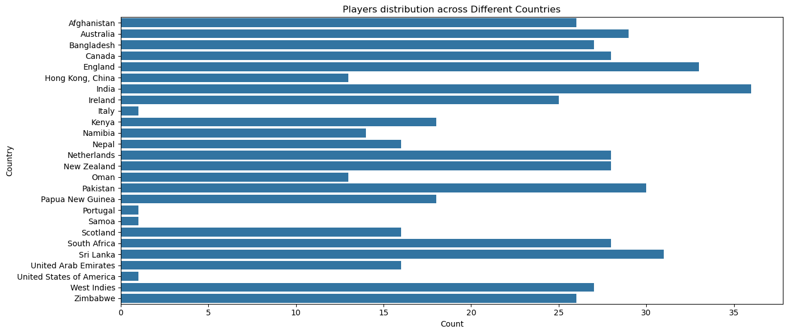
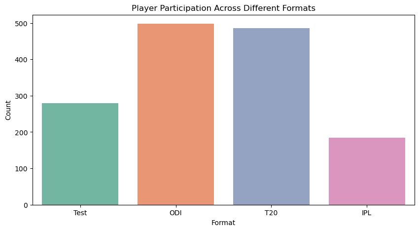
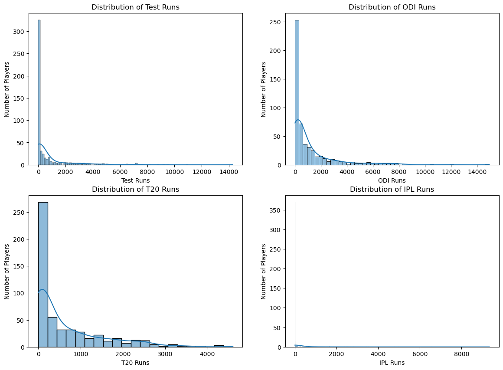
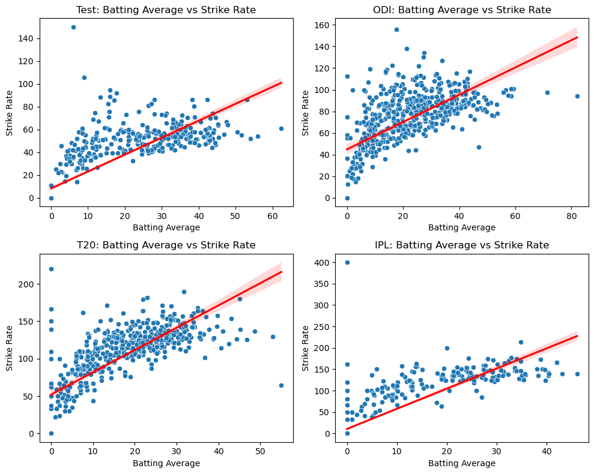
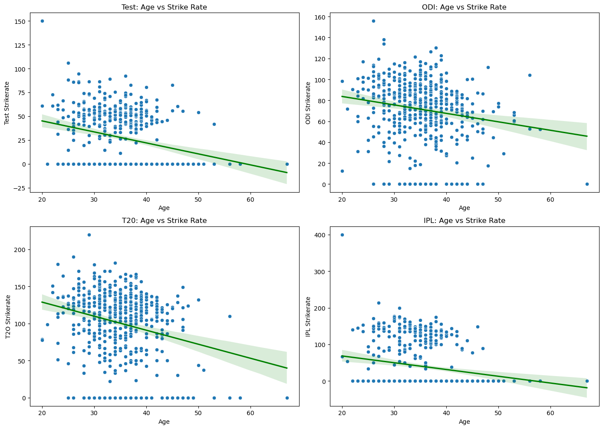
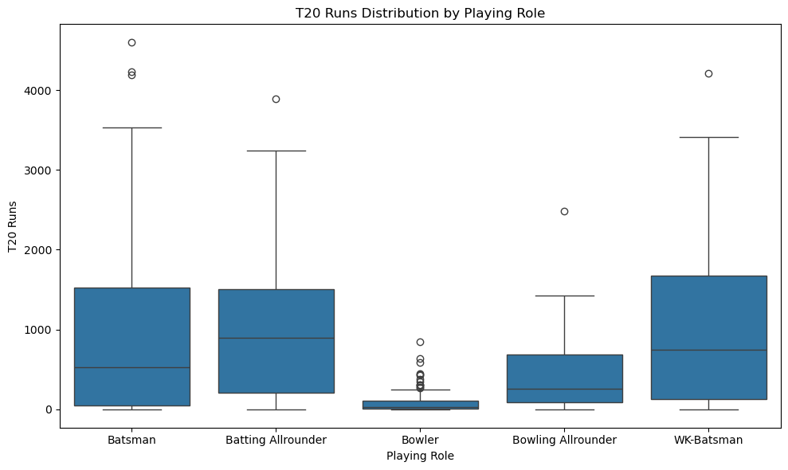
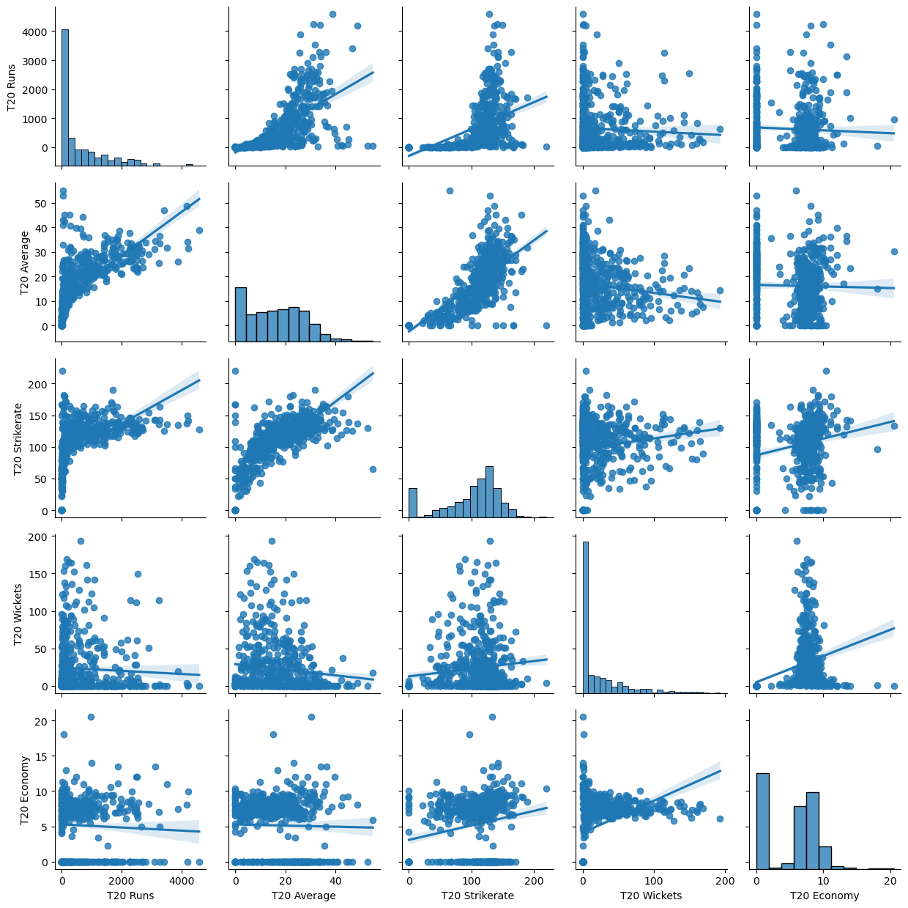
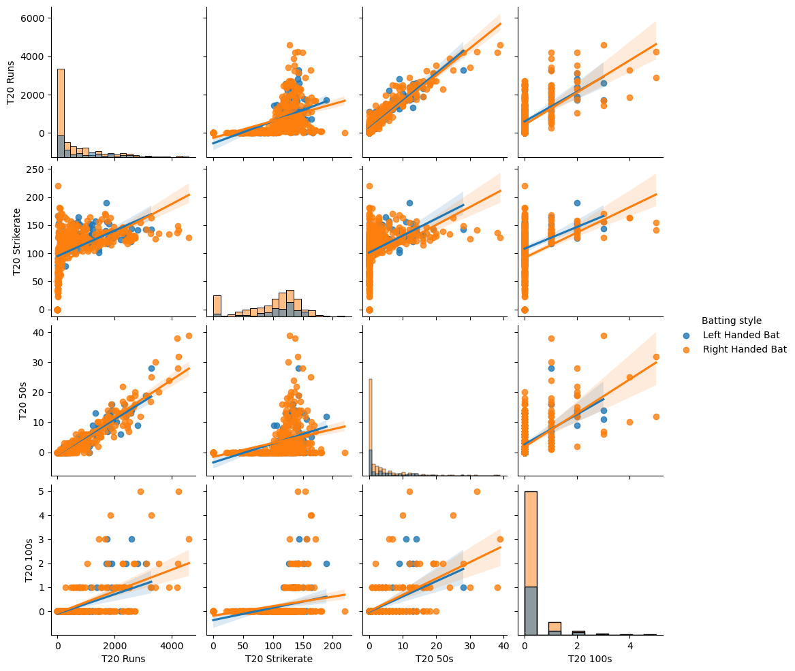
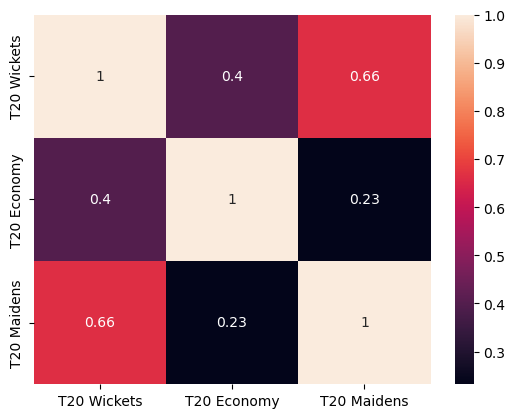

# Cricket-Player-Performance-Analysis
## Project Overview

This project performs Exploratory Data Analysis (EDA) on cricket player data collected from Cricbuzz.

The analysis focuses on identifying meaningful patterns in player characteristics and batting performance across different cricket formats, playing roles, countries, and playing styles.

The project covers data cleaning, exploratory analysis, statistical relationships, data visualization, and data-driven insights.

## Business Problem

Cricket performance data contains a wide range of player-level statistics across different playing roles, countries, and formats such as Test, ODI, and T20. However, these raw statistics are often presented as isolated metrics, making it difficult to identify meaningful performance patterns, compare players across different contexts, and understand how performance varies across roles, countries, and formats.

## Business Objective

The objective of this project is to analyze Cricbuzz player data to identify meaningful patterns in player characteristics and batting performance across different cricket formats, playing roles, and countries.

## Dataset

The dataset contains cricket player-level information collected from Cricbuzz.

- **Records:** 532 players
- **Attributes:** 79
- **Formats:** Test, ODI, T20, IPL
- **Data includes:** Player profile, country, playing role, batting style, bowling style, batting performance, and bowling performance statistics.

### Key Data Categories

- Player profile and demographics
- Country and playing role
- Batting and bowling styles
- Format participation
- Batting performance
- Bowling performance

## Tools & Technologies

- **Python**
- **Pandas**
- **NumPy**
- **Matplotlib**
- **Seaborn**
- **Jupyter Notebook**

## Exploratory Data Analysis

The exploratory analysis was performed to understand player characteristics, format participation, and performance patterns across different cricket contexts.

### 1. Player Profile & Representation

- Distribution of players across countries
- Distribution of players across playing roles
- Distribution of player ages

### 2. Format Participation

- Comparison of player participation across Test, ODI, T20, and IPL formats
- Analysis of player involvement across different cricket formats

### 3. Batting Performance

- Distribution of runs across different formats
- Relationship between batting average and strike rate
- Relationship between age and strike rate

### 4. Bowling Performance
- Distribution of economy across different formats

### 5. Role-Based Performance

- Comparison of T20 runs across different playing roles
- Comparison of T20 wickets across different playing roles

### 6. Multivariate Analysis

- Relationships among multiple batting and bowling performance metrics
- Performance patterns across batting performance and batting styles 
- Correlation analysis of bowling performance metrics

### Key Visualizations

#### Player Distribution by Country

#### Format-wise Player Participation

#### Runs Distribution Across Formats

#### Average vs Strike Rate

#### Age vs Strike Rate

#### Role-wise T20 Performance

#### T20 Performance Correlation

#### T20 Batting Performance Correlation among Different Batting Styles

#### Bowling Performance Correlation

## Key Insights

- Player representation varies considerably across countries, with some countries having much higher representation than others. Country-level comparisons should therefore consider differences in sample size.

- Player participation differs across formats, with ODI and T20 having broader representation in the dataset than Test and IPL.

- Batting performance distributions vary across formats, reflecting differences in career length, match opportunities, and playing conditions.

- Most players in the dataset are concentrated in the late 20s to early 40s, indicating a strong representation of experienced players.

- Batting average and strike rate show a positive relationship across all analyzed formats, with the strongest relationship observed in IPL data.

- Age and strike rate show a weak negative relationship across formats, suggesting that age alone is not a strong predictor of batting strike rate.

- Player roles provide important context when evaluating performance, as batting and bowling contributions vary across different roles.

- Multiple performance metrics provide a more complete view of player performance than relying on a single metric.

## Recommendations

Based on the analysis, player performance should be evaluated within the appropriate cricket format and playing role rather than using a single overall metric.

The analysis also suggests that:

- Multiple performance metrics should be considered when evaluating players.
- Player role should be considered when interpreting batting and bowling performance.
- Age can be used as contextual information rather than as a standalone performance indicator.
- Country-level comparisons should account for differences in player representation.
- Batting and bowling styles can be used to understand player profiles and performance patterns, but should not be interpreted as direct causes of performance.

## Conclusion 
The analysis identified meaningful patterns in player performance across formats, roles, countries, age, and playing styles.

The findings show that player performance varies by context, and no single metric is sufficient to evaluate a player. Using multiple performance metrics with proper context provides a more comprehensive understanding of cricket player performance.
